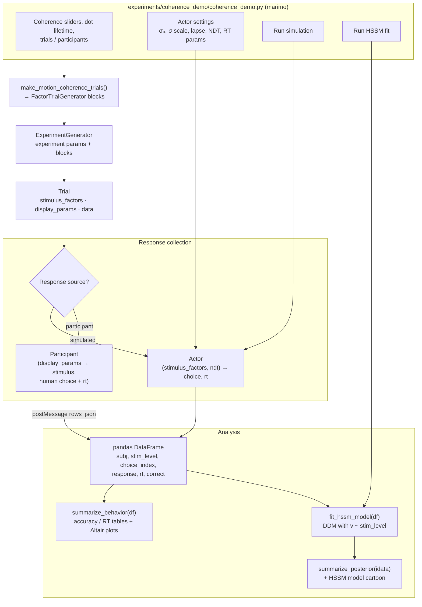
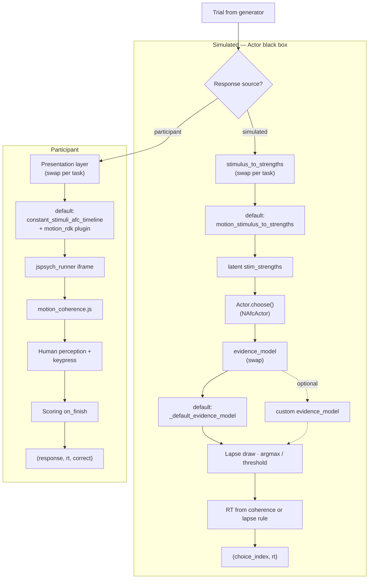
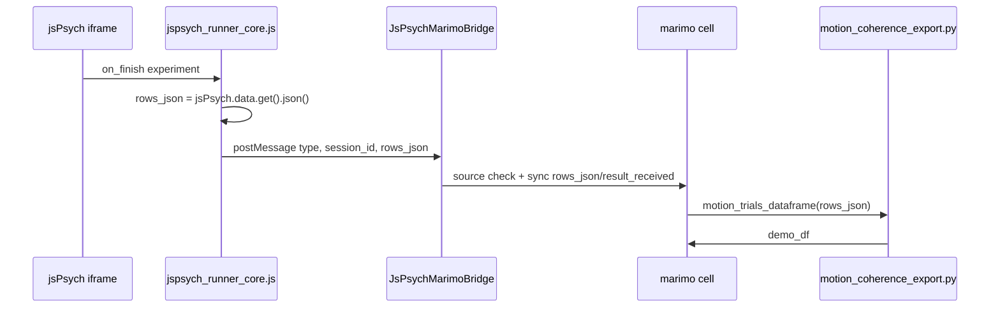

# Project Documentation

## Scope

This repository is organized as a modular experimentation and analysis workspace.  
It supports:

- browser-based task logic and previews
- interactive control and orchestration in `marimo`
- synthetic and participant-facing data collection flows
- downstream sequential-sampling analysis and visualization

The design favors interchangeable components so task logic, stimulus delivery, and actor/input sources can evolve without rewriting the full stack.

## Pipeline flowchart

End-to-end flow for the coherence marimo app (`experiments/coherence_demo/coherence_demo.py`). Trials are built once; **response collection** swaps a simulated **Actor** for a human participant; **analysis** (`analysis/hssm_pipeline.py`) summarizes the simulated DataFrame and optionally fits HSSM. Step-by-step detail is in [Runtime Flow](#runtime-flow).



After **Run simulation**, marimo builds `df` and renders `summarize_behavior` plots. **Run HSSM fit** is a separate control that calls `fit_hssm_model` then `summarize_posterior` (and the model cartoon).

The **Actor** node is a black box in this view. The diagram below is the same stage opened up: simulated path implements the box in Python (`actors/prior_predictive_actor.py`); the participant path replaces it with browser presentation plus human input.

### Actor: simulated vs participant



**Simulated Actor — swappable hooks** (each arrow targets the **default** box used in this repo):

| Hook | Default (in diagram) | Typical swap |
|------|----------------------|--------------|
| `stimulus_to_strengths` | `motion_stimulus_to_strengths` | Another per-task mapper in `coherence_demo/coherence_demo.py` or at `NAfcActor` construction |
| `evidence_model` | `_default_evidence_model` | Custom `Callable` on `NAfcActor` |
| Actor class | `NAfcActor` | Another class under `actors/` with the same `(factors, ndt) → (choice, rt)` surface |
| Presentation (participant) | `constant_stimuli_afc_timeline` + `motion_rdk` stimulus plugin | Other `AFCStimulusPlugin` + `renderers/` HTML |

**Tuned on `NAfcActor` but fixed policy** (not plug-in hooks): `sigma0`, `sigma_scale`, `lapse_rate`, `evidence_weight`, `rt_scale`, `rt_noise`. Decision and RT rules inside `choose()` stay unless you replace the agent class.

**Participant path** — swap the presentation hook; the **default** motion stack is shown in the diagram. The human is the decision maker. Only `display_params` (and jsPsych metadata) affect what they see; `stimulus_factors` are mirrored in logging/scoring, not fed to `NAfcActor`.

Internal decision/RT steps for the default simulated Actor are diagrammed in [`actors/actorsDescriptions.md`](actors/actorsDescriptions.md).

## Directory Map

Current structure:

- `experiments/`
  - `coherence_demo/` - marimo coherence → HSSM demonstration
    - `coherence_demo.py` - orchestration (demo runner, controls, simulation, plotting, model calls)
    - `coherence_timeline.py` - jsPsych demo timeline (intro, countdown, motion + feedback) and runner config
    - `motion_stimulus_plugin.py` - registers `motion_rdk` `AFCStimulusPlugin` for constant-stimuli presentation
    - `motion_coherence_export.py` - task adapter: jsPsych rows → motion `DataFrame` for HSSM/simulation
    - `coherence_demo.css` - marimo UI styles for the demonstration
  - `paat_demo/` - guided PAAT play → explore → simulate → fit → check notebook
    - `paat_app.py` - Marimo orchestration and explicit scientific guards
    - `paat_timeline.py` - jsPsych instructions, choices, outcome animations, and breaks
    - `paat_export.py` - exact schedule/session-bound browser export validation
    - `paat_app.css` - PAAT notebook layout
- `schemas/`
  - `contracts.py` - shared typed contracts (`ExperimentParams`, `Trial`, result message types)
  - `trial_generator.py` - abstract `TrialGenerator` and `FactorTrialGenerator`
  - `experimentGenerator.py` - `ExperimentGenerator`: experiment params + multiple `TrialGenerator` blocks
  - `timelines/`
    - `constant_stimuli_afc_timeline.py` - factorized n-AFC jsPsych timeline + stimulus plugin registry
- `renderers/`
  - `motion_coherence/` - RDK stimulus package
    - `motion_coherence_stimulus.py` - Python HTML helpers for jsPsych trials and marimo previews
    - `motion_coherence.js` - canvas animator + DOM helper (`MotionCoherence`, `__startAllMotionCanvases`)
    - `motion_coherence.css` - layout for stimulus wrapper and canvas
  - `paat_wheels/` - reward/aversive wheel markup, styles, and browser controller
- `observers/`
  - `paat_ssm.py` - task-regression mapping and stock `ssm-simulators` angle simulation
- `actors/`
  - `prior_predictive_actor.py` - virtual actor behavior models
  - `actorsDescriptions.md` - notes and flowcharts for each agent (`NAfcActor` decision and RT rules)
- `runtime/`
  - `jspsych_runner.py` - `RunnerConfig` + HTML assembly (timeline/config base64 injection)
  - `jspsych_plugins.py` - jsPsych CDN plugin registry
  - `embed.py` - marimo `srcdoc` iframe helper
  - `jspsych_runner.html` - runner page skeleton
  - `jspsych_runner.css` - runner layout overrides (inlined)
  - `jspsych_runner_core.js` - generic timeline decode, plugin bind, jsPsych lifecycle, `postMessage` export
  - `jspsych_runner_boot.js` - reads injected config/timeline and starts core
  - `jspsych_export.py` - task-agnostic jsPsych row parsing, `DataFrame` pipeline, marimo `postMessage` bridge
  - `demo_results_charts.js` - in-iframe Vega-Lite accuracy/RT charts after demo completion
- `analysis/`
  - `hssm_pipeline.py` - fit/summarize helpers for HSSM analyses
  - `descriptive_stats.py` - d-prime and standard error descriptive statistics helpers
  - `paat_analysis.py`, `paat_fit.py`, `paat_plots.py` - support-aware PAAT summaries, stock HSSM angle fitting, diagnostics, and plots
- `README.md` - quickstart and run instructions
- `DOCUMENTATION.md` - this architecture guide
- `pyproject.toml` - project metadata and dependencies
- `uv.lock` - locked dependency graph for reproducible environments
- `.python-version` - local Python version hint

## Module Responsibilities

### `experiments/coherence_demo/coherence_demo.py`

Role:

- assembles the end-to-end interactive workflow in marimo
- includes an interactive participant-like demo block above simulation controls (iframe + `demo_df` export)
- exposes UI controls for coherence levels, dot lifetime, trials/participants, and actor parameters
- uses separate run controls for simulation and HSSM fit
- renders task previews in the notebook UI
- runs data simulation loops using trial and actor modules
- executes HSSM model fitting and displays summaries/charts including an HSSM model cartoon plot

Motion display settings for this app only (not shared defaults elsewhere):

- fixed canvas sizes for previews and demo trials (`MOTION_CANVAS_*`, `MOTION_PREVIEW_*`)
- dot count, speed (px/s), and seed (`MOTION_N_DOTS`, `MOTION_SPEED_PX_S`, `MOTION_SEED`)
- dot lifetime from the **Dot lifetime (s)** number input (passed to previews and demo timeline)

Motion display settings and motion-specific trial sampling (`make_motion_coherence_trials`, `motion_stimulus_to_strengths`) live in `coherence_demo/coherence_demo.py` only.

Key integration boundaries:

- imports trial builders from `schemas/`
- imports actor behavior from `actors/`
- imports preview rendering helpers from `renderers/`
- imports model-fit utilities from `analysis/`
- keeps orchestration separate from implementation modules

Key helper structure:

- builds demo timeline via `experiments/coherence_demo/coherence_timeline.py`
- uses `runtime/embed.py` for iframe embedding and `RunnerConfig` for demo runner options

### `schemas/contracts.py`

Role:

- ``ExperimentParams``, ``Trial``, ``JsPsychTrial``, ``SimulatedObservation``, ``JsPsychResultsMessage``
- shared data shapes for trial generators, experiment organization, jsPsych adapters, and analysis export

### `schemas/trial_generator.py`

Role:

- abstract ``TrialGenerator``: stores an ordered list of trial parameter dicts, tracks an internal index, exposes ``next_trial()``, ``reset()``, and ``has_next()``
- ``FactorTrialGenerator``: concrete implementation for explicit / factorial trial lists; ``generate_trials()`` builds one trial dict

Trial generators do **not** own experiment-wide display defaults or output paths; they only build and iterate trials for one block (e.g. one coherence level).

### `schemas/experimentGenerator.py`

Role:

- ``ExperimentGenerator`` holds ``ExperimentParams`` (``display_params``, ``data_output_path``) and an ordered list of ``TrialGenerator`` instances
- ``add_trial_generator()`` attaches a block; ``next_trial()`` walks blocks in order, merging experiment ``display_params`` into each trial (trial keys win on conflict)
- ``all_trials()`` materializes the full experiment without advancing cursors

Simulation and the motion demo attach one ``FactorTrialGenerator`` per condition level (or per demo trial) via ``add_trial_generator()``.

### `schemas/timelines/constant_stimuli_afc_timeline.py`

Role:

- `AFCStimulusPlugin` — pluggable `render_stimulus(trial, index)` plus optional `on_load` / `on_finish`
- `constant_stimuli_afc_timeline(trials, stimulus_plugin=...)` — maps factorized n-AFC trials to jsPsych `html-keyboard-response` entries
- `build_afc_keyboard_trial` — single-trial builder; reads `choices`, `correct_key`, `presentation_duration_ms`, and `display_params` from the trial contract
- `register_stimulus_plugin` / `get_stimulus_plugin` — named plugins (e.g. motion RDK registered in `experiments/coherence_demo/motion_stimulus_plugin.py`)

### `experiments/coherence_demo/coherence_timeline.py`

Role:

- coherence-demo-only jsPsych timeline: intro → 3–2–1 countdown → motion trials (+ per-trial feedback)
- exports `coherence_runner_config()`, `build_coherence_demo_levels()`, `build_coherence_timeline()`
- demo coherence levels come from marimo sliders (A/B/C)
- `coherence_runner_config()` enables in-iframe result charts and loads `motion_coherence.js` + CSS

### `actors/prior_predictive_actor.py`

Role:

- contains virtual actor classes for synthetic behavioral data
- models response policy, sensory uncertainty behavior, and lapse/random errors
- can be expanded to host multiple actor families (simple prior predictives, SSM-consistent agents, etc.)

Current `NAfcActor` behavior:

- Accepts experiment ``stimulus_factors``; derives latent ``stim_strengths`` via ``stimulus_to_strengths``.
- ``evidence_weight`` is an actor parameter (default all ones = no directional bias).
- Latent evidence defaults to `evidence_weight * stim_strengths + Gaussian noise`.
- Sensory noise uses `sigma = sigma0 + sigma_scale * c` where `c` is driven by task difficulty (`1 - coherence`, `coherence = max(stim_strengths)`).
- Lapse path is explicit: with probability `lapse_rate`, choice is random and RT is generated from lapse RT logic.
- Non-lapse choice for n-AFC uses `argmax(evidence)`; 1-stimulus mode uses sign-threshold detection.
- Non-lapse RT: `rt = ndt + rt_scale × (1 − coherence) + noise`, with `coherence = max(stim_strengths)`.
- Optional `evidence_model` can override latent evidence generation while preserving shared evidence for choice and non-lapse RT.

Why it exists:

- clean separation between *task definition* and *response-generation policy*
- enables swapping human-input channels vs simulated agents with minimal orchestration changes

### `renderers/motion_coherence/`

Role:

- `motion_coherence_stimulus.py` — marimo preview iframes and jsPsych trial canvas markup
- `motion_coherence.js` — RDK animator and `MotionCoherence.createMotionCoherenceCanvas` DOM helper
- `motion_coherence.css` — stimulus wrapper and canvas layout (via `RunnerConfig.extra_styles`)

Motion stimulus contract (canvas `data-*` attributes read by `motion_coherence.js`):

- `data-stim-level`, `data-dir-sign`, `data-seed`, `data-n-dots`
- `data-speed-px-s` — motion speed in pixels per second (time-based `requestAnimationFrame` updates)
- `data-dot-lifetime-s` — dot survival time in seconds; expired or out-of-bounds dots respawn at a new random location

Canvas elements use explicit pixel width/height (no responsive scaling) so speed is consistent across browsers.

Why it exists:

- visual preview logic should not live inside trial-generation or actor classes
- allows changing rendering implementation (Canvas, jsPsych plugin views, media assets) without changing trial or analysis code

### `runtime/jspsych_export.py`

Role:

- **Task-agnostic** jsPsych participant export for marimo apps
- `flatten_jspsych_row`, `parse_rows_json`, `jspsych_rows_to_dataframe(include_row, row_to_record, columns)`
- `create_jspsych_marimo_bridge()` — source-bound `mo.ui.anywidget` listener for iframe `rows_json`; requires the result nonce and exact iframe ID, and exposes `result_received`

Task-specific filters and record mappers live under `experiments/<task>/` (e.g. `motion_coherence_export.py`).

### `runtime/jspsych_runner.py`

Role:

- creates a standalone jsPsych runtime HTML document for iframe `srcdoc`
- `RunnerConfig` selects plugins, optional `extra_scripts`, input policies, and optional end-of-run charts
- injects timeline + config as base64 JSON for the boot script
- loads CDN plugin scripts from `jspsych_plugins.py`

### `runtime/embed.py`

Role:

- wraps runner HTML in a marimo-safe `<iframe srcdoc="...">` helper

### jsPsych → marimo (Python) participant data export

Browsers cannot write project files on the server. Participant trials leave the jsPsych iframe via **`window.parent.postMessage`**, are captured in marimo with **`mo.ui.anywidget`**, and are normalized in Python to the same `DataFrame` columns as simulation (`subj`, `stim_level`, `choice_index`, `response`, `rt`, `correct`).

#### End-to-end flow



#### 1. Export from the iframe (`runtime/jspsych_runner_core.js`)

On experiment end, use jsPsych’s **`.json()`** export and post that string to the parent. Do **not** use `jsPsych.data.get().values()` with `JSON.stringify` — custom trial fields (`task`, `stim_level`, `correct`, …) are dropped and Python will see only plugin metadata.

```javascript
const rowsJson = jsPsych.data.get().json();
window.parent.postMessage(
  {
    type: "jspsych-results",
    rows_json: rowsJson,
    session_id: config.results_session_id,
  },
  "*",
);
```

`RunnerConfig.results_message_type` defaults to `"jspsych-results"`. The coherence demo sets this via `coherence_runner_config()`.

#### 2. Capture in marimo (`runtime/jspsych_export.py`)

```python
from runtime.jspsych_export import create_jspsych_marimo_bridge

demo_results = create_jspsych_marimo_bridge(
    session_id=demo_session_id,
    iframe_id=demo_iframe_id,
)
```

`create_jspsych_marimo_bridge()` returns **`mo.ui.anywidget(...)`** so trait updates re-run downstream cells. The widget accepts a message only when its type and session nonce match and `event.source` is the exact sandboxed iframe window. It syncs `rows_json` and sets `result_received = true`; adapters can distinguish an unfinished session from a completed empty export. Read data only in **downstream** cells.

**Marimo layout rule:** the cell that builds the demo **iframe must not** depend on `demo_results`. Otherwise, when export updates, marimo re-runs the iframe cell and the demo restarts at the intro screen.

#### 3. Task adapter (example: `experiments/coherence_demo/motion_coherence_export.py`)

Runtime provides a generic pipeline; each task supplies a row filter and record mapper:

```python
from runtime.jspsych_export import jspsych_rows_to_dataframe

df = jspsych_rows_to_dataframe(
    rows_json,
    include_row=my_task_row_predicate,
    row_to_record=my_task_row_mapper,
    columns=MY_COLUMNS,
)
```

The coherence demo uses the bundled adapter:

```python
from motion_coherence_export import motion_trials_dataframe

demo_df = motion_trials_dataframe(demo_results.value["rows_json"])
```

`motion_coherence_export.py` merges nested jsPsych `data`, keeps `task == "motion_coherence"` trials, maps lowercase arrow responses, and converts `rt` from ms to seconds when needed. Errors raise normally (no silent fallbacks).

#### Dependencies

- `anywidget` (see `pyproject.toml`) for the marimo bridge widget.

### jsPsych v7 runtime contract

The runner targets **jsPsych 7** (CDN). There is **no global `jsPsych`** object.

- `jspsych_runner_core.js` calls `initJsPsych(...)` and assigns `window.__jsPsychInstance`.
- Eval'd trial callbacks (Python string `on_finish` / `stimulus` functions) must use `window.__jsPsychInstance` for `data`, `pluginAPI`, etc.
- Do not reference bare `jsPsych` in timeline strings (throws `MigrationError`).

Example (motion scoring):

```javascript
function(data) {
  const j = window.__jsPsychInstance;
  data.correct = j.pluginAPI.compareKeys(data.response, data.correct_key);
}
```

Extension pattern for new tasks:

1. Add renderer HTML contract (if needed) under `renderers/`
2. Add browser stimulus assets under `renderers/<paradigm>/` (JS/CSS) and reference via `RunnerConfig.extra_scripts` / `extra_styles`
3. Register an `AFCStimulusPlugin` and pass it to `constant_stimuli_afc_timeline` (or reuse `map_trials_to_jspsych_timeline` with a custom builder)
4. Pass `RunnerConfig(plugins=(...), extra_scripts=(...), input_arrow_keys=...)` when building HTML
5. Use `window.__jsPsychInstance` in any eval'd jsPsych trial callbacks

### `analysis/descriptive_stats.py`

Role:

- provides descriptive statistics helpers independent of fitting pipeline
- includes `dprime(...)` with mode-based inputs (`rates` or `counts`)
- includes `standard_error(...)` with mode-based inputs (`values` or `percentages`)
- keeps descriptive statistics separate from HSSM model-fitting code

## Runtime Flow

### Browser demo (participant-like)

1. marimo builds a timeline via `build_coherence_timeline()` (`ExperimentGenerator` + per-level `FactorTrialGenerator` blocks) using slider levels A/B/C and user dot lifetime.
2. `build_jspsych_runner_html(timeline, config=coherence_runner_config())` inlines HTML/CSS/JS assets.
3. `render_srcdoc_iframe()` embeds the runner; user clicks **Restart demo** to rebuild with fresh random directions.
4. Boot script decodes timeline + config; `JsPsychRunnerCore` binds plugins and runs jsPsych.
5. After intro, a 3-second countdown runs; then motion trials call `__startAllMotionCanvases` on `on_load`.
6. Scoring uses `__jsPsychInstance` on `on_finish`; feedback trials follow each motion trial.
7. On experiment end, in-iframe Vega-Lite charts summarize accuracy and mean RT by coherence (`demo_results_charts.js`).
8. Runner posts `{ type: "jspsych-results", rows_json, session_id }` to the parent page (`jspsych_runner_core.js`).
9. `create_jspsych_marimo_bridge()` verifies the nonce and iframe source, then syncs `rows_json` and `result_received`; a downstream marimo cell builds `demo_df` via `motion_trials_dataframe`.

### Python simulation + HSSM

1. marimo UI collects task and actor parameters.
2. Per condition level, `make_motion_coherence_trials()` returns a `FactorTrialGenerator` block; blocks are attached to an `ExperimentGenerator`, which serves trials with merged experiment `display_params` / `data_output_path` when set.
3. `NAfcActor.choose(stimulus_factors)` builds latent evidence, choice, and RT (explicit lapse path).
4. tabular data is assembled for modeling.
5. user triggers HSSM fit with dedicated run control.
6. summaries and charts are rendered in-app (including model cartoon).

## Probabilistic Selection Task (PST) demo

The PST is a second paradigm built on the same layers. It is explicitly a shortened teaching variant, not an exact replication. `experiments/pst_demo/pst_app.py` lets a user play the task, explore the data, simulate RL-DDM players, fit the learning phase with HSSM, and inspect a single-dataset recovery illustration.

The model equations follow Pedersen, Frank & Biele (2017), while task length, priors, likelihood implementation and presentation are app-specific choices. Design decisions and scientific limitations are recorded in `PST_PLAN.md`.

| Layer | Module | Role |
|---|---|---|
| Task | `schemas/tasks/pst.py` | Pairs AB/CD/EF (80/20, 70/30, 60/40); seeded schedules with both possible rewards pre-drawn; balanced/shuffled adaptive blocks; all 15 test pairings. The app defaults to a quick profile (one-to-two 30-choice blocks, four practice choices, two test repetitions when enabled); Thorough preserves two-to-four 60-choice blocks, six practice choices and six test repetitions. `score_choice` accuracy-codes response +1 as the better symbol / upper DDM boundary. Shared 4 s deadline and 0.2 s anticipation threshold. |
| Actors | `actors/pst_rl.py` | `PSTLearner` and `PSTEnvironment` are `ssms.rl` plug-ins. `PSTSimulator` delegates to the official `ssms.rl.Simulator` and maps deadline omissions and sub-0.2 s anticipations to native omission sentinels before the generative learning update, while retaining their distinct reason. Computed `v` and `a` are clipped to the built-in DDM LAN support. Includes paper-derived presets, bounded individual variation, latent replay and a frozen-value test-phase simulation. |
| Browser | `renderers/pst_symbols/`, `experiments/pst_demo/pst_timeline.py`, `pst_stimulus_plugin.py` | Hiragana or shape cards, answered by key or click. Anticipations receive no outcome or points, so excluding them cannot remove a learning event that the participant observed. Raw rows retain `response_method`. |
| Export | `experiments/pst_demo/pst_export.py` | jsPsych rows → PST response table. Re-scores choices, checks the exact Python schedule, feedback and timing flags, and rejects duplicate, missing, reordered or over-deadline rows. Finished app sessions must also contain every enabled phase and end on the first permissible adaptive block. |
| Analysis | `analysis/pst_analysis.py`, `analysis/pst_plots.py` | Learning/RT curves, signed RTs and choose-A / avoid-B summaries. Anticipations and omissions are excluded from fitted and final-round summaries. RLSSM input is balanced after exclusions, with every removal reported. |
| Fitting | `analysis/pst_fit.py` | Stock `hssm.rl.RLSSMConfig.from_ssms_model(...)` and `hssm.RLSSM`, using HSSM's built-in differentiable, approximate DDM LAN. One participant gets an intercept model; multiple participants get participant random effects for every free parameter. Support-preserving generalized-logit links are used. Native `Simulator(...).simulate(mode="ppc")` produces conditional replicated choices and RTs. |

**Units.** ssms and HSSM place the DDM bounds at ±a, so `a` is half the Wiener boundary separation used in the paper. The paper's `bb` values are therefore halved in the presets.

**Response table** (`PST_RESPONSE_COLUMNS`):

- `participant_id`, `phase`, `block`
- `trial` (1-based; drives a(t))
- `pair`, `pair_id`
- `left_symbol`, `right_symbol`, `better_symbol`, `worse_symbol`, `chosen_symbol`, `choice_side`
- `response` (+1 / −1)
- `feedback` (0 / 1; none in the test phase)
- `rt` (seconds)
- `timed_out`
- `anticipated` (answered before 0.2 s; no feedback is shown)
- `response_method` (`key`, `click`, `simulated`, or none for an omission)

**Fitting and model checking.** Only valid learning responses enter RLSSM. Multiple participants are fitted hierarchically, and the balanced-panel requirement is enforced after exclusions. Posterior tables report r-hat, bulk/tail ESS and MCSE; interpretation and posterior predictive plots are withheld unless convergence, ESS, divergences, BFMI and tree-depth checks pass. The PPC is HSSM/SSMS's observed-history-conditioned mode: simulated choices and RTs are generated while learning-state updates follow the observed choices and outcomes. Replicated deadline omissions and anticipations are reported separately.

**Scientific scope.** The built-in DDM likelihood is a neural likelihood approximation, not the analytical Wiener likelihood. Values of computed `v` and `a` outside its validated support are clipped, changing the unconstrained Pedersen model in those regions. Omissions are generated with the same total-RT deadline as the browser, but RLSSM cannot fit censored trials: omissions are dropped and the likelihood does not correct for deadline truncation. The fit also deliberately disables HSSM's lapse/outlier mixture (`p_outlier=0`). The app's priors are regularizing choices on HSSM's link scale, not the paper's hierarchical priors. The quick profile improves completion time at the cost of less information and more prior-sensitive individual fits. Test-phase choices are descriptive and are not included in the RL-DDM fit. One simulate–fit result is an internal consistency illustration, not evidence about bias, interval coverage or general parameter recoverability.

**Runner/runtime behavior:**

- nested jsPsych timelines, with `conditional_function` / `loop_function`;
- `RunnerConfig.revive_keys` is now honoured by the browser;
- `RunnerConfig.results_view` selects the end-of-run view;
- `load_vega` makes the Vega scripts optional;
- `RunnerConfig.focus_guard` dims the task with "Click here to play" and pauses between trials whenever the iframe cannot receive key presses (keys only reach an iframe after it is clicked);
- jsPsych's per-trial focus call no longer scrolls the host page.
- each result channel has a fresh session nonce and is bound to its specific iframe window;
- embedded `srcdoc` frames are sandboxed with scripts allowed but without same-origin privileges.

**Dependencies.** The declared API floors are HSSM ≥ 0.4 and ssm-simulators ≥ 0.13.2. The 2026-09-29 lock resolves the current releases, HSSM 0.5.0 and ssm-simulators 0.14.0; the fast suite is also exercised in an isolated environment at both declared floors. No range was broadened during consolidation. HSSM's built-in DDM LAN artifact is downloaded from Hugging Face on first use if it is not cached.

**Tests.** `uv run pytest` runs fast Python and browser-script checks. `uv run pytest -m slow` runs real single-participant and hierarchical HSSM fits plus native PPC, and is intentionally computationally intensive. `uv run marimo check --strict experiments/pst_demo/pst_app.py` validates the reactive graph.

## Probabilistic Approach-Avoidance Task (PAAT) demo

`experiments/paat_demo/paat_app.py` is a guided Play → Explore → Simulate → Fit → Check notebook based on Cheng et al. (2026). Its `conference` profile is a 24-trial teaching design. The two 96-trial profiles match paper/OSF congruency totals but use synthetic evidence schedules; they are not canonical replications.

| Layer | Module | Role |
|---|---|---|
| Task | `schemas/tasks/paat.py` | Seeded probability schedules, side balancing, pre-drawn wheel/outcome randomness, response coding, and one frozen predictor scale shared across profiles and participants. |
| Browser | `renderers/paat_wheels/`, `experiments/paat_demo/paat_timeline.py` | Reward/aversive wheels, keyboard/click choice, fixed deadline, neutral public aversive placeholder, and deterministic outcome playback. |
| Export | `experiments/paat_demo/paat_export.py` | Reconstructs outcomes only after exact schedule, order, immutable-field, response-window, nonce, and iframe-source checks pass. |
| Simulation | `observers/paat_ssm.py` | Maps the PAAT regression to trial-wise drift and delegates choices/RTs to stock `Simulator(model="angle")` after installed-bound validation. Optional participant heterogeneity varies drift coefficients only, matching the teaching hierarchy. |
| Analysis | `analysis/paat_analysis.py`, `analysis/paat_plots.py` | Reports omissions and anticipations, diagnoses regression support, and plots drift only at predictor cells present in each congruency group. |
| Fitting | `analysis/paat_fit.py` | Uses stock `hssm.HSSM(model="angle", loglik_kind="approx_differentiable")`. The optional hierarchy places participant effects on drift only; `a`, `z`, `t`, and `theta` are pooled. The lapse mixture is disabled to match the stock simulator's data-generating process. |

**Interpretation boundary.** Congruency is determined by the sign of relative reward, so reward support is disjoint across conditions and strongly correlated with the congruency indicator. There is no observation at zero standardized reward. The model's raw congruency intercept is therefore off-support; the notebook labels it as non-interpretable and excludes it from the single-fit truth check. Pair means are allowed to vary: only the 0.8 probability difference forces a mean of 0.5. HSSM's `safe` priors are used instead of the paper's full hierarchical priors, and one truth-in-interval overlay is not presented as a recovery or coverage study.

**Deadline boundary.** The six-second simulator deadline produces explicit no-response rows. The packaged HSSM `angle` LAN is an observed-choice/RT likelihood and does not model these right-censored omissions. Every fit reports omissions, remains conditional on observed responses, and is blocked above a 5% omission rate either overall or for any participant. The threshold is a demo safeguard rather than a censoring correction.

**Ecosystem boundary.** PAAT itself is not a registered HSSM/SSMS task model. The notebook needs no PAAT-specific SSM: it maps task predictors to the stock angle model's `v` while reusing the native `[v, a, z, t, theta]` simulator and packaged `angle.onnx` likelihood. `verify_review.py --hssm` checks parameter order, choices, bounds, both HSSM model shapes, and direct deprecated-API absence against the installed packages. Future fitting of deadline-censored omissions would require upstream likelihood support before the notebook could claim it.

Full design decisions and the executable review-gate contract are in `PAAT_PLAN.md`.

**Verification.** `uv run python verify_review.py --hssm` is an executable scientific gate and exits nonzero on a failed claim. Fast PAAT contracts run under the normal suite; marked slow tests construct and sample individual and v-only hierarchical HSSM models.

## Extension Guidelines

Use these boundaries when adding new functionality:

- **New task types**: add simulator classes/functions under `schemas/`
- **New stimuli modalities**: add preview/render helpers under `renderers/`
- **New actor/input sources**: add classes under `actors/` and keep choice/RT coupled to the same latent signal model when possible
- **New analysis models**: add model-specific fit/plot helpers under `analysis/`

Prefer data contracts (plain dict/dataframe schemas) between modules over direct cross-calls to keep components interchangeable.

## Data Contracts (Current)

Experiment-level (`ExperimentParams`):

- `display_params` — defaults merged into each trial's `display_params` by `ExperimentGenerator`
- `data_output_path` — optional; copied into each trial's `data` as `data_output_path` when set

Trial-level fields currently used by the pipeline:

- `task`
- `stimulus_factors` (experiment factors controlling the stimulus)
- `display_params` (presentation/display parameters)
- `presentation_duration_ms` (`None` = unlimited until response)
- `correct_index`
- jsPsych metadata fields (`choices`, `correct_key`, nested `data`, etc.)

Modeled dataset fields:

- `subj`
- `stim_level`
- `choice_index`
- `response`
- `rt`
- `correct`

Any new task module should document equivalent fields and provide a normalization step if names differ.

## Packaging Notes

The project follows a split-by-concern layout (`schemas/`, `renderers/`, `actors/`, `analysis/`) with `experiments/` housing marimo entrypoints.
